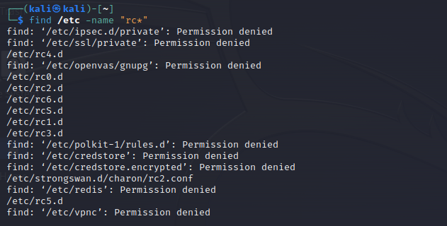
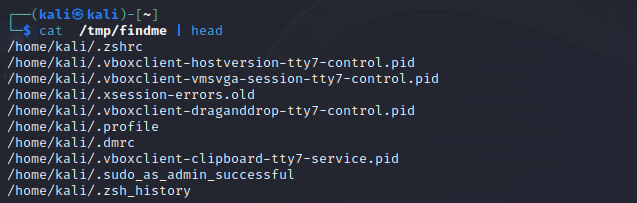
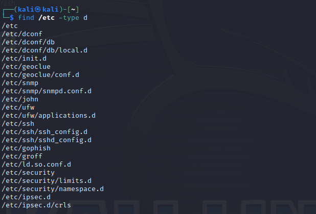
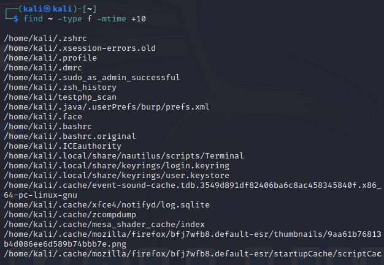
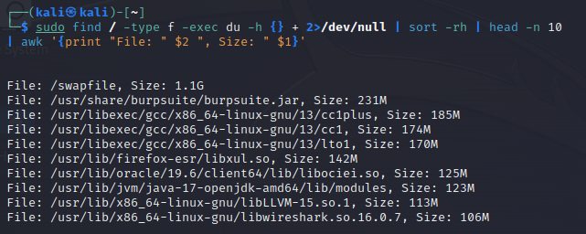

### Using the find command, find and list the names of:
- all files under the /etc directory whose names begin with rc
  

- all regular files belonging to you; put the result in the file /tmp/findme and errors in/dev/null
  
  

- all subdirectories of /etc
  

- all regular files under your home directory that have not been modified in the last 10 days
  

- The 10 largest file in your computer
  

