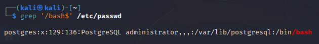
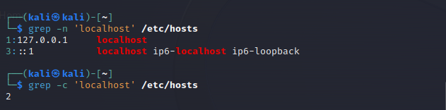
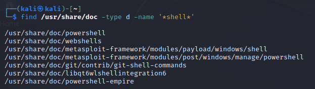
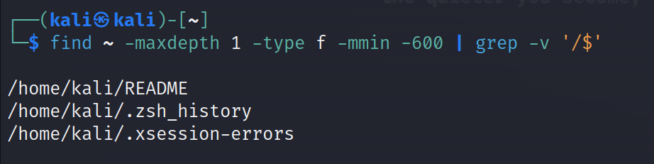
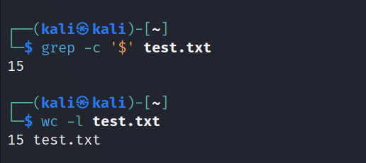
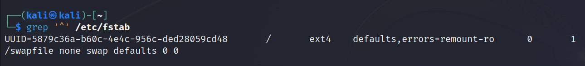

## Display a list of all the users on your system who log in with the Bash shell as a default.:
To do this, we must search in the file `/etc/passwd` the lines that end with the word `/bash`.
```bash 
grep '/bash$' /etc/passwd
```


> **What contains the file etc/passwd?**.
>
>This file is a plain text-based database that contains information for all user accounts on the system. It includes details such as username, UID (User Identifier), GID (Group Identifier), full name, home directory, and the login shell. Each user's information is stored on a separate line, with fields separated by colons.
> 
> A line in this file look like:
> username:x:UID:GID:User Name:/path/to/username:/bin/bash

## From the /etc/group directory, display all lines starting with the string "daemon":
```bash 
grep '^daemon' /etc/group
```

*There is one group named deamon in my system*

## Print all the lines from the same file that don't contain the string:
```bash 
grep -v 'daemon' /etc/group
```

> **Note:**.
>
>Option "-v" means 'invert the match'. It will select lines that do not match the given pattern. 

## Display localhost information from the /etc/hosts file, display the line number(s) matching the search string and count the number of occurrences of the string:
- Count line numbers
```bash 
grep -n 'localhost' /etc/hosts
``` 
- Count occurrences
```bash 
grep -c 'localhost' /etc/hosts
```

*There are two lines that contain localhost (the first line and the third one)*

## Display a list of /usr/share/doc subdirectories containing information about shells.
```bash 
find /usr/share/doc -type d -name '*shell*'
``` 


*The find command searches directories recursively by default. When we run `find /usr/share/doc -type d -name '*shell*'`, it will start at /usr/share/doc and look through all the subdirectories underneath it for directories that match the pattern *shell**

## How many README files do these subdirectories contain? Don't count anything in the form of "README.a_string".
**We have to count files in the subdirectories and excluding those with an extension**
```bash 
find /usr/share/doc/*shell* -type f -name 'README*' | grep -Pc 'README$(?!\.)'
``` 
*To test it, I created one README file without any extension in a subdirectory of /usr/share/doc that includes shell in its name, and then created some README files with .md extension in another subdirectories of the same type of directories.*

## Make a list of files in your home directory that were changed less that 10 hours ago, using grep, but leave out directories.
```bash 
find ~ -maxdepth 1 -type f -mmin -600 | grep -v '/$'
``` 


## Can you find an alternative for wc -l, using grep?.
For counting lines in a file, we use `wc -l`
```bash 
wc -l manar_file.txt
```
This command count the number of lines in the file "manar_file.txt"

As an alternative using grep, we can exploit the option `-c` of grep to count the number of matching lines with a pattern that will help us to detect any charcater in the lines. 

```bash 
grep -c '$' manar_file.txt
``` 


*This is just a suggestion of an alternative command of wc -l using $ pattern (lines that end with any character). we can use also the pattern ^ (lines that start with ay character) or combining multiple espace sequences (\d , \w , ...)*

## Using the file system table (/etc/fstab for instance), list local disk devices.
```bash 
grep '^' /etc/fstab
``` 

*the fstab don't contain any local disk device in my case which could be due to the virtualize environment*

Normally, disk devices start with **/dev**, in orther to list them we can use the command below:
```bash 
grep -E '^/dev/[a-zA-Z0-9]+' /etc/fstab
``` 
## Display configuration files in /etc that contain numbers in their names.
```bash 
ls /etc/*[0-9]*.conf
``` 

