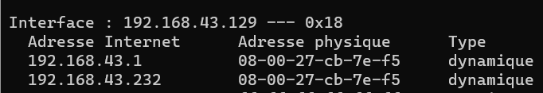

# How ARP Works?
ARP stands for Address Resolution Protocol. It's a fundamental protocol used in IP networking to map an IP address to a physical machine address that is recognized in the local network.

When a device wants to communicate with another on the same local network, it uses ARP to find out the MAC address associated with the intended IP address. The device sends an ARP broadcast query packet to all devices on the network, asking "Who has this IP address?". The device with the matching IP address responds with its MAC address, enabling direct communication at the data link layer.

# ARP POISONING?

ARP poisoning involves sending unsolicited ARP replies to falsely associate the attacker's MAC address with the IP addresses of other devices in the network. This positions the attacker as a man-in-the-middle, intercepting communications.

# Let's getting hands dirty!
> **NOTE:**.
>The activities described here, including the use of Kali Linux for ARP poisoning and traffic analysis with Wireshark, were conducted solely for educational purposes as part of this internship program.
> 
> Such exercises are meant to enhance understanding of network security vulnerabilities in a controlled and ethical environment. Engaging in these practices outside of such a context can be illegal and unethical

## Environement
- Kali linux imported in Oracle Virtual box [Kali linux VM](https://www.kali.org/get-kali/#kali-virtual-machines)
- Your local machine or another guest VM (in this case, it is my windows local machine)
- Connected to internet
## Scenario of what we gonna do
#### Parts of this scenario
- Kali linux 192.168.43.232  :7e:f5
- Windows    192.168.43.129  :F9:20
- Gateway    192.168.43.1    :8c:7f


## Practice
- In your kali linux, execute the command: 
```bash 
sudo sysctl net.ipv4.ip_forward=1
```
> **NOTE:**.
>This step is crucial for the ARP poisoning attack to be successful.
>
> This command make IP forwarding enabled on Kali Linux to allow it to act as a router, forwarding packets between the Windows machine and the gateway. This step ensures that while Kali intercepts the traffic, it also maintains network connectivity by relaying packets, preventing the network from detecting the attack due to dropped connections.

- Look for ip and mac address of these three devices
  - in your Kali linux

Execute the command below to know your ip and mac address:
```bash 
ifconfig
```


  - in Windows

Execute the command below to know your ip and mac address:
```bash 
ipconfig /all
```
- Let's take a look if these devices know about each others
  -in your kali linux
```bash 
arp-a
```

*My Guest VM only knows about the gateway*

-in Windows
```bash 
arp-a
```


> **arp-a**
> 
> it displays the ARP table, which contains IP addresses mapped to the corresponding MAC addresses for devices on your local network.

These two devices (Windows & Kali) communicate through the same gateway, they are in the same network
- Open wireshark tool in kali linux
- Open Ettervap_graphical tool in kali linux
  - Leave options as they are, and hit check button
    

  - Hit the search button (it scans the local subnet)
  - Click in "Hosts Lists" button at the top bar to dispaly scanned hosts
  - Choose your windows machine as "target 1" and the gateway as "target 2" (or vice versa)
## Let's see what happened 
- Let's check wireshark captures
  - ARP Frames sent to windows

*Kali send **an unsolicited arp replay (arp response that it never asked for)** to the target 192.168.43.129 (windows machine) pretending that he is the sender 192.168.43.1 (gateway adress) by sending his mac address (7e:f5)*


  - ARP Frames sent to the gateway
  
*The same thing here with the gateway as a target*


- Arp tables

*Now, the windows machine has the kali linux address mac for the gateway address ip*

**Now we can capture any trafic from windows machine to the internet and vice versa**, Altough we're able to do that, it doesn't mean that we're able to decrypt everything captured (espicially TLS sessions). 
