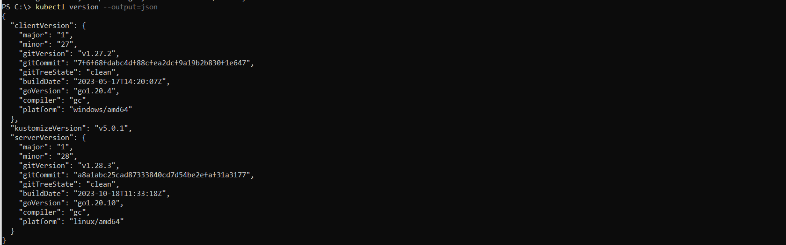
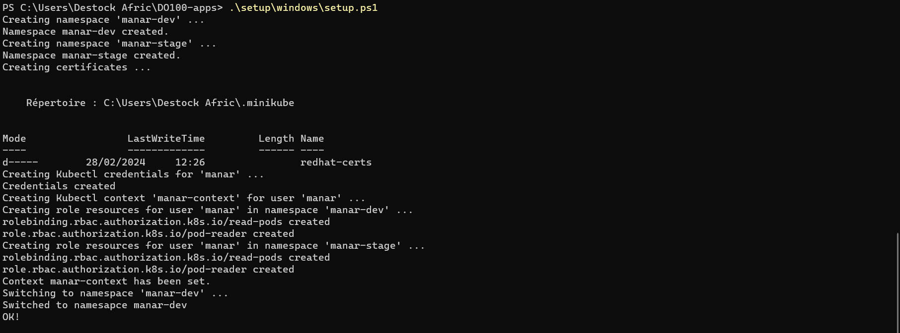

# Contrasting Kubernetes Distributions
Minikube is a lightweight tool designed for local development and testing of Kubernetes applications. It allows developers to quickly spin up a single-node Kubernetes cluster on their local machine, providing an environment similar to a full Kubernetes cluster but with minimal resource requirements.

*Enabling Microsoft Hyper-V*
-------------------

*Create an external virtual switch named minikube*
-------------------

*install minikube*
-------------------

*start minikube cluster*
-------------------

*verify minikube status*
-------------------

*check extensions list*
-------------------

*add ingress add-on*
-------------------

*associate minkube ip address with the hostname host.example.com in hosts file*
-------------------

*add dashboard add-on*
-------------------

*minikube dashboard*
# Connecting kubectl to Your Cluster

*create kube directory under C:/*
- Install kubectl

*Download kubectl*
-------------------

*Add kubectl to path*
-------------------

*Check kubectl version*
- Connect to Minikube
  - if it's not already installed, [install openSSSL](https://www.youtube.com/watch?v=PgP9oGGxLG0)
  - clone the [git repo](https://github.com/RedHatTraining/DO100-apps.git)

  I have a windows operating system, so I executed `.\setup\windows\setup.ps1`

***Ooops ERROR***

If you encountered the same error (username starts with a capital letter), you need to do a tiny change in the setup.ps1 file.

change the first line of `setup.ps1` file by this line: $USERNAME = $env:USERNAME.ToLower()

Execute again the script.

*And it should be executed successfully*

# Running and Interacting with Your First Application
- Create Pods From Container Images
  
- Create deployment
  
- exec commands within an existing pod
  

# Deploying managed application
- Create a deployment
  
-------------------
>kubectl is a command-line tool that allows us to interact with Kubernetes clusters. It serves as the primary interface for managing Kubernetes clusters, including deploying applications, inspecting cluster resources, debugging issues, and performing various administrative tasks.
>
>With kubectl, we can perform operations such as: deploying applications; managing pods, deployments and more; interacting with pods, etc.
> 
